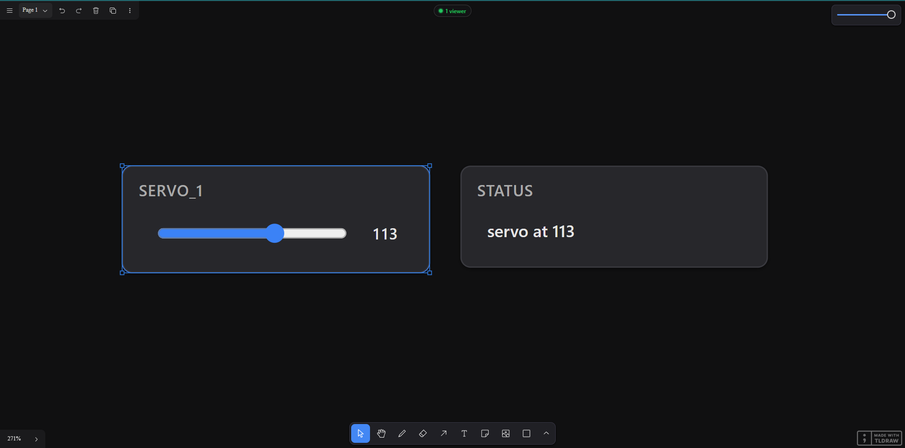

# danvas

danvas builds interactive browser UIs — dashboards, control panels, live
visualizations — entirely in Python, with no HTML, JavaScript, or build step. You
make panels (sliders, plots, tables, buttons, video feeds, or your own React/HTML)
in Python; they appear on a zoomable browser canvas. A panel is just a face on
your program: a click or edit calls a normal Python function running in your
process, with full access to your code, libraries, hardware, and files — so
anything you can script, you can give a UI and drive live. State flows over one
WebSocket; Python owns it, the browser renders it and reports what the user did.

It's multi-user out of the box: any number of browsers — phones, tablets, or
desktops — share one live canvas, with a viewer roster, live cursors, chat, and
freehand drawing the host can read back. Share it across your LAN, behind a
password, or over a public HTTPS tunnel — all built in, no extra services.

## Install

```bash
pip install danvas
```

The base install is deliberately light: the serving engine is the `danvasd`
binary (bundled in the platform wheel, so `pip install` is all it takes), and the
Python side needs only `websockets` + `orjson`. Heavier features are optional
extras:

| Extra | Enables |
|---|---|
| `pip install "danvas[video]"` | `VideoFeed` JPEG encoding (OpenCV, ~90 MB) |
| `pip install "danvas[audio]"` | microphone capture for `AudioFeed` |
| `pip install "danvas[tunnel]"` | public sharing (`serve(tunnel=True)`) |
| `pip install "danvas[desktop]"` | native window + `bake()` to a standalone app |
| `pip install "danvas[serial]"` | `python -m danvas.serial COM3` — wire a no-network device (Arduino/UART) onto a canvas |
| `pip install "danvas[hub]"` | run the Python reference hub `python -m danvas.merge` (FastAPI/uvicorn) |

`canvas.video(...)` needs `[video]` for default encoding — or stream
already-JPEG bytes with `VideoFeed(encode=False)`, which needs nothing. For local
development, clone and `pip install -e .` (a checkout builds `danvasd` with
`cargo build --release --manifest-path broker/Cargo.toml`).

## Hello world

```python
import danvas

canvas = danvas.Canvas()
servo  = canvas.slider("servo_1", min=0, max=180, default=90)
status = canvas.label("status", "idle")

@servo.on_change
def handle(value):
    status.update(f"servo at {value}")

canvas.serve(port=8000)   # opens the browser, blocks
```



## The mental model

Every danvas program is the same five steps:

```python
import danvas

canvas = danvas.Canvas()                          # 1. make a canvas
speed  = canvas.slider("speed", min=0, max=100)    # 2. make components (panels)
status = canvas.label("status", "idle")

@speed.on_change                                   #    read user input back …
def _(v, viewer):                                  #    (optional 2nd arg = who did it)
    status.update(f"{viewer['name']} set speed to {v}")   # … and push state out

speed.set_layout(x=40, y=40, w=320)                # 3. place/size it (optional)
canvas.set_view(zoom=1.0, ui=True)                 # 4. set camera/chrome (optional)
canvas.serve(port=8000)                            # 5. serve — opens browser, blocks
```

Build panels → register callbacks → `serve()`. The rest of this README follows
that path: [the canvas](#the-canvas) → [components](#components) →
[layout](#layout) → [shapes](#canvas-shapes) → [views & roles](#views-navigation--roles)
→ [serving & sharing](#serving--sharing) → [persistence, inspection & packaging](#persistence-inspection--packaging),
then [how it works](#how-it-works).

> **Handlers run on one ordered worker thread**, separate from the event loop, so
> a blocking handler (`time.sleep`, an HTTP call, slow compute) never freezes
> rendering or live `update()`s, and handlers run **in order**. That thread is
> shared, so a genuinely slow handler delays other panels' handlers until it
> returns — mark it [`threaded=True`](#receiving-input) to move it off, or
> write it `async def` (it then runs on a shared asyncio loop).

# The canvas

`danvas.Canvas()` is the document everything hangs off. Build panels with its
factories (below) and manage them through it:

```python
canvas.remove(panel)      # destroy: gone from Python and browser
canvas.hide(panel)        # remove from browser, keep Python state (value/callbacks)
canvas.unhide(panel)      # show again at last position
canvas.clear()            # remove every panel + arrow at once
canvas.connect(a, b, text="x2", color="blue")   # arrow bound between two panels (or shapes)
canvas.disconnect(arrow)
canvas["servo_1"]         # reach any panel by its name= (the canonical accessor)
canvas.servo_1            # same, as sugar — but canvas["..."] always wins if a name
                          # collides with a Canvas method (e.g. "inspector"); "x" in canvas works
canvas.components         # list of every panel (visible and hidden)
canvas.arrows             # list of arrows
panel.visible             # True if currently shown
```

**`hide` vs `remove`** — `hide` is reversible: the panel disappears from the
browser but stays alive in Python (id, value, callbacks intact); `unhide` brings
it back. `remove` is permanent — the id is gone, and re-inserting makes a brand
new panel. Use hide/unhide for panels you toggle on and off; remove when one is
genuinely done.

### Shared React components & styles

When you build custom UI with `react(...)`, repeating the same widget in every
panel's source gets old. `canvas.define()` registers a JSX component **once**,
usable *by name* in every React panel; `canvas.style()` adds **one** global
stylesheet (vs a panel's own scoped `css=`):

```python
canvas.define("StatusPill", """
  function StatusPill({ kind, children }) {
    return <span className={"pill " + kind}>{children}</span>
  }
""")
canvas.style(".pill{padding:2px 10px;border-radius:999px} .pill.ok{color:#4ade80}")

# now ANY react() panel can use it, no re-declaration:
canvas.react("function Component(){ return <StatusPill kind='ok'>In stock</StatusPill> }")
```

Both replay to every browser on connect and apply live while serving; a `define()`
mid-session recompiles open panels. They reach native `react()` panels only —
sandboxed `custom()` iframes are isolated. See `examples/shared_components.py`.

# Components

`canvas.<factory>(...)` builds a panel **and** places it, returning the handle.

```python
servo = canvas.slider("servo_1", min=0, max=180, default=90)
feed  = canvas.video("camera")
plot  = canvas.live_plot("servos", traces=["s1", "s2"])
```

**Argument convention.** Content-rendering panels take their content first
(`image(src)`, `table(data)`, `markdown(text)`, `toggle(options)`, `custom(html)`,
`react(source)`, `webview(url)`, `show(value)`); all others put `name=` first.
`name` is optional everywhere (it defaults to the type, e.g. `"slider"`) and is
the panel's Python identity — the `canvas.<name>` handle and the key that makes a
later insert under the same name **replace in place**. `label=` sets a different
on-screen caption. Every factory also forwards [`insert`'s placement and lock
options](#layout).

Build-now-place-later (or onto another canvas):

```python
s = danvas.Slider("servo_1", min=0, max=180, default=90)
canvas.insert(s, x=80, y=80)
```

## The component catalogue

| Component | Direction | API |
|---|---|---|
| `Slider` | bidirectional | `.value`, `@on_change`, `.update(v)`; `step=` (fractional → float slider + number entry), `on_release=True`; live: `.min`, `.max`, `.step`, `.color` |
| `Toggle` | bidirectional | `.value`, `@on_change`, `.update(opt)`; `options=[...]`; live: `.options`, `.color` |
| `Button` | input | `@on_click`, `.value` (click count), `text=`, `.update(text)`; live: `.text`, `.color` |
| `TextField` | bidirectional | single-line or `multiline=True`; `@on_change` on Enter/blur; `.value`, `.update(text)`, `placeholder=`; live: `.placeholder`, `.color` |
| `Label` | output | escaped text/number; `.update(text)`; `h="auto"`; live: `.color` |
| `Markdown` | output | rendered Markdown; `.update(text)` |
| `Image` | output | path/URL/bytes/Matplotlib/PIL/array; `.update(src)`, `fit=`; live: `.color` |
| `Table` | bidirectional | DataFrame/Series/records/dict/array → sortable, filterable, paginated; toolbar toggles index/column-visibility/row-selection (+ ✎ edit when `editable=True`); `@on_select(indices)`, `@on_edit(row, col, value)`; `.selected`, `.update(data)` |
| `Plot` | output | `.update(fig)` — a Plotly figure rendered natively, with the interactive toolbar (zoom/pan/box-zoom/save-PNG on hover) |
| `LivePlot` | output | streaming telemetry; `.push({trace: y \| [y…]}, x=)`, `.clear()`, `smoothing=`; live: `.max_points`, `.mode`, `.color` |
| `Histogram` | output | distribution over time; `.add(values, step)`; `color=` tints frame + chart |
| `VideoFeed` | output | `.update(bgr_frame)` → binary JPEG; `encode=False` for pre-encoded |
| `AudioFeed` | output | `.update(pcm_chunk)` → Web Audio playback |
| `Chat` | bidirectional | shared room across viewers; `.post(text)`, `@on_message` |
| `WebView` | output | external site in an iframe; `.navigate(url)` |
| `FileBrowser` | bidirectional | navigate a folder (sandboxed to `root=`); `@on_select`, `.value`, `pattern=` |
| `Upload` | input | click/drop zone receiving a viewer's file; `@on_upload`, `dest=` (stream to disk), `accept=`, `multiple=`, `max_size=` |
| `Download` | input | button sending a host file/`bytes` to the viewer; `source=` or `@provide`, `filename=` |
| `Custom` | bidirectional | arbitrary HTML/CSS/JS in a sandboxed iframe; `@on(event)`/`@on_message`/`@on_request`/`@on_binary`, `.push(data)`/`.push_binary(bytes)`, `.update(html)`; `themed=True` |
| `React` | bidirectional | your JSX, compiled in-browser, theme-aware; `@on(event)`/`@on_request`/`@on_binary`, `.update(**props)`, `.push(data)`/`.push_binary(bytes)`, `css=` |
| `Inspector` | output | live panel/globals state browser |

Most `color=` panels expose `.color` (and most accept `lock`/`chrome` flags) —
see [Controlling panels live](#controlling-panels-live).

## The three data verbs

| Verb | Means | Replayed on reconnect? | Panels |
|---|---|:--:|---|
| `.update(value)` | **replace** the panel's whole state | ✅ | Label, Image, Table, Markdown, Plot, Slider, Toggle, Button, VideoFeed, AudioFeed |
| `.push(sample)` | **append** one sample to a live stream | ❌ | LivePlot, Custom, React |
| `.add(values, step)` | **record** one distribution at `step` | ✅ | Histogram |

```python
label.update("ready")                  # replace: the label IS this text
plot.push({"train": loss}, x=step)     # append: one more point on a live curve
weights.add(layer.weight, step=epoch)  # record: one distribution row
```

`LivePlot.push` also takes a **batch** (a list/array per trace, with matching `x`)
to add many points in one call — your lever on update *rate*: buffer in your loop
and flush when you choose. The server coalesces updates a slow client can't keep
up with, as a safety ceiling.

```python
plot.push({"train": losses, "val": vals}, x=steps)   # many points at once
```

## Show anything

`canvas.show(value)` inspects a value and inserts the best-fitting panel — like a
notebook deciding how to render `Out[...]`, but in plain scripts too:

```python
canvas.show(df)                        # DataFrame / records / list-of-lists → Table
canvas.show({"lr": 3e-4, "epochs": 40})# flat dict → key/value Table
canvas.show(arr_uint8)                 # NumPy uint8 / RGB array → Image
canvas.show(fig)                       # Matplotlib / seaborn / Plotly → Image / Plot
canvas.show(sns.relplot(...))          # any seaborn grid (it carries a figure)
canvas.show({"nested": {"a": 1}})      # nested dict/list → collapsible JSON tree
canvas.show("use **bold**")            # Markdown syntax → rendered text
canvas.show("report.csv")              # existing file → Table; "photo.png" → Image
canvas.show(altair_chart)              # _repr_mimebundle_ / _repr_html_ → its rich view
```

There's no per-library special-casing — it rests on **two universal rules**, so a
package danvas has never heard of still renders: (1) **the notebook display
protocol** — anything with `_repr_mimebundle_` / `_repr_html_` / `_repr_png_` /
`_repr_svg_` renders exactly as it would inline (altair, bokeh, folium, graphviz,
sympy, styled DataFrames, `IPython.display.*`, …), and in a notebook the live
IPython formatter is consulted first; (2) **the figure it carries** — anything
built on Matplotlib (seaborn, `df.plot()`, …) is detected by the `Figure` it *is*
or holds (`savefig` / `get_figure` / `.figure` / `.fig`), not by its package. The
same applies to `update()`, so re-rendering a fresh figure each loop is one call.

Dispatch is conservative (a single `*italic*` isn't Markdown; a path must be a
real file). No `name` → a fresh panel each call; `name=` replaces in place.
`danvas.panel_for(value)` builds without inserting. Extra kwargs are forwarded to
the chosen component when it accepts them, ignored otherwise; placement kwargs
(`below=`, `x=`, …) always route to `insert()`. See `examples/show_anything.py`.

## Controlling panels live

Every panel:

```python
panel.update(...)                 # push new state (signature varies per component)
panel.move(x, y); panel.resize(w, h); panel.rotate(deg)
panel.set_layout(x=, y=, w=, h=, rotation=, opacity=, locked=, ...)   # any combo, one message
panel.to_front(); panel.to_back(); panel.forward(); panel.backward()  # z-order
panel.x, panel.y, panel.w, panel.h, panel.rotation, panel.opacity     # read/write live
panel.label = "New title"         # live card-header rename
panel.value                       # current value (sliders, toggles, button count)
panel.queue = "latest"            # backpressure policy (below)
```

**Accent color** — any `color=` panel exposes `.color` as a live read/write
property; assigning re-tints the panel's theme + card border instantly:

```python
status = canvas.label("status", "idle", color=(0, 200, 0))
status.color = (100, 100, 255)   # (r, g, b) tuple or "#rrggbb" hex
status.color = None              # reset to default theme
```

Works at construction and live on Label, Slider, Toggle, Button, TextField, Table,
Chat, Image, VideoFeed, AudioFeed, Plot, LivePlot, FileBrowser, and any
`react`/`custom` panel. Some components also have specific live setters
(`slider.min/max/step`, `toggle.options`, `text_field.placeholder`).

**Streaming backpressure** — `queue` decides what happens when updates outpace a
slow viewer: `"fifo"` (default, deliver everything in order) or `"latest"` (keep
only the newest pending value per viewer — right for video/telemetry; `VideoFeed`
defaults to it).

```python
plot = canvas.live_plot("temps", queue="latest")   # or plot.queue = "latest" later
```

## Receiving input

| Handler | Component(s) | Args | Fires when |
|---|---|---|---|
| `@panel.on_change` | Slider, Toggle, TextField | `(value)` | user commits a value |
| `@button.on_click` | Button | `()` | pressed |
| `@table.on_select` | Table | `(indices)` | row selection changes |
| `@table.on_edit` | Table | `(row, col, value)` | cell edited (`editable=True`); value is a string |
| `@chat.on_message` | Chat | `(entry)` | viewer posts |
| `@browser.on_select` / `on_navigate` | FileBrowser | `(path)` / `(cwd)` | file clicked / dir changed |
| `@upload.on_upload` | Upload | `(file)` | file received (`file.data` or `file.path`) |
| `@panel.on_layout` | any | `(comp)` | user drags/resizes the panel |
| `@panel.on("event")` / `on_message` | Custom, React | `(msg)` | `canvas.send(...)` from the panel |
| `@panel.on_binary` | Custom, React | `(data: bytes)` | `canvas.sendBinary(buf)` from the panel |
| `@panel.on_request("event")` | Custom, React | `(req)` | `await canvas.request(...)` — return resolves the Promise |
| `@panel.on_error` | Custom, React | `(msg)` | JS error in the panel |

These are plain registration methods, so `@panel.on_change` and
`panel.on_change(fn)` are the same — decorate for the common case, or call it
directly to reuse one handler across panels.

**Who did it.** *Any* handler may declare a trailing `viewer` parameter; one-arg
handlers are unchanged:

```python
@slider.on_change
def _(value, viewer):     # {"id","name","color","device","role"}
    print(viewer["name"], "→", value)
```

<a id="the-viewer-dict"></a>The `viewer` dict (same shape everywhere):

| key | what | trust |
|---|---|---|
| `id` | stable per-connection roster id (use with `client_id=`) | client-side — attribution only |
| `name` / `color` | editable display name / roster color | client-side |
| `device` | `"mobile"` / `"desktop"` from the User-Agent | client-side — presentation only |
| `role` | login level from `serve(passwords=)`, else `None` | **server-trusted — authorize on this** |
| `cursor` | `{"x","y"}` in canvas coords, or `None` (with `serve(cursors=True)`) | client-side |

Gate permissions on `role` only. On an **upload** the attribution fields are
`None` unless the uploader is still connected (the file arrives over HTTP, matched
to the live roster by id) — read them with `.get(...)` and a fallback.

The role rules are **enforced server-side, not just in the UI**: a panel's live
updates and media frames are only sent to viewers whose role may see it, a
`canvas.request` reply goes only to the socket that asked, and a hand-crafted
`input`/`request`/binary frame for a panel that is role-hidden, `locked`,
`operable=False`, or `lock_for`-locked for that viewer is dropped before any
handler runs. Your `on_*` handlers therefore only ever fire for viewers the
panel is live for — `role` checks inside a handler are for *app-level* rules
(who may do what), not for re-verifying panel access.

**Action routing + field validation.** `@panel.on("name")` dispatches by the
payload's routing field, so a panel with several actions reads as one named
handler each instead of an `if msg["action"] == …` ladder (set the field with
`event_key=`). `fields={name: type}` coerces values off the wire before the
handler runs — a value that can't coerce drops the message (and logs why) instead
of crashing the handler:

```python
@stock.on("item_set", fields={"stock": int, "price": int})
def _(msg):                        # msg["stock"]/["price"] are ints here
    inventory[msg["item"]] = {"stock": msg["stock"], "price": msg["price"]}
```

**Handler threading — three modes, plus `async def`.** Handlers run on one shared
dispatch thread by default (off the event loop, so the UI never freezes — but a
slow one holds up those queued behind it). Two flags move a handler off it:

| Flag | Thread model | Right for |
|---|---|---|
| *(default)* | inline on the shared dispatch thread | fast handlers: state updates, canvas calls |
| `threaded=True` | a new daemon thread *per call* | occasional slow work (HTTP, `sleep`, one-off compute) |
| `dedicated=True` | one persistent thread *for this handler* | handlers firing rapidly with non-trivial work |

```python
@fetch.on_click(threaded=True)              # new thread per click; doesn't block others
def _(viewer):
    table.update(slow_api_call())

@speed.on_change(dedicated=True, queue="latest")   # own serialised thread; drop stale drags
def _(v):
    status.update(heavy_compute(v))
```

`threaded` may run alongside itself (guard shared state); `dedicated` is always
serialised on its own thread. `queue=` (only with `dedicated`) is `"fifo"` (run
all in order) or `"latest"` (keep only the newest pending call). The two are
mutually exclusive. *(This `queue=` is handler-side dispatch backpressure;
`insert(panel, queue=…)` is the separate browser-delivery backpressure above.)*

**Any handler may be `async def`** — every `on_*` registration accepts a
coroutine function. It runs on a shared asyncio loop (its own daemon thread, not
the server's), so an awaiting handler never blocks the dispatch thread and many
can be in flight at once — the natural fit for `httpx`/`aiohttp`/asyncio-native
libraries. `@panel.on_request` coroutines reply when they complete; with
`dedicated=True` the coroutine is awaited to completion on that handler's own
thread, so it stays serialised.

```python
@fetch.on_click
async def _():
    async with httpx.AsyncClient() as client:
        table.update((await client.get(url)).json())
```

**Adapt to who connects.** `canvas.on_connect(fn)` runs `fn(viewer)` once per
join (e.g. a mobile layout via per-viewer `client_id=`); `on_disconnect(fn)` is
the cleanup twin. `on_cursor(fn)` streams pointer moves (`serve(cursors=True)`).
Don't trust `device` for auth — it's a spoofable User-Agent guess.

```python
@canvas.on_connect
def adapt(viewer):
    if viewer["device"] == "mobile":
        for i, panel in enumerate(panels):
            panel.set_layout(client_id=viewer["id"], x=0, y=i * 220, w=360)
```

## Custom & React panels

Two factories ship your own UI from Python. **`react`** mounts JSX as a real React
subtree (native, theme-aware, interactive from first hover — reach for this
first); **`custom`** drops HTML/CSS/JS into a sandboxed iframe. They share the
**same `canvas` handle** — `send`/`request`/`onFrame`/`sendBinary`/`viewport`/
`setView`/`chat` — so the two are interchangeable in capability (the iframe just
adds a `postMessage` hop and needs `themed=True` to follow the theme). Both are
bidirectional: `canvas.send(...)`/`request(...)` go up, `push`/`update` send down.

### React

Pass full `source=` defining `function Component({ canvas, value, props })`, or
just `jsx=` markup + `css=`:

```python
counter = canvas.react(jsx='<button onClick={() => canvas.send({n: 1})}>tap</button>',
                       css='button { font-size: 18px; }')
```

- `value` is the latest `push(data)`; `props` is the `update(**props)` dict
  (replayed on reconnect). The `canvas` prop is the bridge handle:
  `send(data)` (→ `@on`/`@on_message`), `request(data)` (awaitable, → `@on_request`),
  `sendBinary(buf)` (an `ArrayBuffer` *up* to Python → `@on_binary`, zero-copy),
  `onFrame(cb)` (subscribe to `push` with no re-render; `ArrayBuffer` for binary),
  `paintFrame(canvasEl)` (blit streamed image bytes to a `<canvas>`, decoded off the
  main thread — what `VideoFeed` uses),
  `viewport(cb)` / `setView({x,y,zoom})` (read/move the camera), `chat` (the shared room).
- `push_binary(bytes)` → `onFrame` as a zero-copy `ArrayBuffer` (down); `canvas.sendBinary(buf)`
  → `@on_binary` is the up direction (binary travels both ways, like `Custom`).
- `scope=["d3"]` loads ESM libs from a CDN as the `libs` global (friendly names
  like `d3`/`lodash`/`framer-motion`/`lucide` are pinned builds).
- `wasm_path="sim.wasm"` (or `wasm=bytes`) embeds a module, reached as
  `await canvas.wasm` inside the JSX. For >1 MB, host the `.wasm` and fetch by URL.
- `source=` normalises pasted web snippets (`import`/`export`, `styled-components`,
  hooks). React panels **auto-height by default** (pass numeric `h` to pin).
- **`update(roles=…, client_id=…, **props)`** scopes props to specific viewers as
  a persistent per-viewer overlay (precedence shared < role < client) — each viewer
  sees only their slice, replayed on reconnect (unlike one-shot `push`). See [Roles](#views-navigation--roles).
- **`panel.watch(path=…, css_path=…)`** dev hot-reloads the JSX/CSS on save;
  **`panel.validate()`** is a fast structural lint.
- `forward_wheel=False` lets the panel's content keep the wheel (scroll a list,
  pan a map, zoom a 3D canvas) instead of zooming the canvas — the same option
  as on `Custom`. Default `True` keeps the canvas-zoom behaviour.

### Custom

```python
panel = canvas.custom(html='''
  <button onclick="canvas.send({event: 'go'})">go</button>
  <script>canvas.onPush((msg) => document.body.append(msg))</script>
''')

@panel.on("go")            # routes {event:'go'}; @on_message is the catch-all
def handle(msg):
    panel.push("clicked")  # → canvas.onPush in the iframe
```

- `html`/`css`/`js` may be separate strings (handy for pasted snippets). A bare
  fragment is wrapped with a base reset (sane margins, `box-sizing`, centred), so
  you don't hand-write a `<style>` reset; a complete `<html>` page is left as-is.
  `update(html)` swaps the whole document; `push(data)` streams without reloading.
- The iframe's `canvas` handle **mirrors the React panel's**, so the two panel
  kinds share one mental model: `send` / `onPush`, plus `request(data)` (awaitable,
  → `@on_request`), `viewport(cb)` and `setView({x,y,zoom})` (read/move the camera),
  and `chat` (the shared room: `send`/`setName`/`history`/`subscribe`/`identity`).
- **`themed=True`** makes the iframe follow the canvas theme — danvas forwards the
  live `--pc-*` variables and dark/light flag in, so the panel's CSS can use
  `var(--pc-bg)` / `var(--pc-text)` / `var(--pc-accent)` and track dark mode, the
  way an inline React panel does (a sandboxed iframe is otherwise theme-isolated).
- `push_binary(bytes)` streams raw bytes (no base64); `canvas.onPush` gets an
  `ArrayBuffer`. Honours `queue="latest"` for video/sensor streams.
- **`canvas.sendBinary(buf)`** transfers an `ArrayBuffer` *up* to Python with zero
  overhead → `@panel.on_binary` (mark it `threaded=True` if it decodes/computes).
  (React panels have `sendBinary` too — binary is bidirectional on both.)
- **`canvas.requestCamera(opts)`** / **`requestMicrophone(opts)`** capture the
  webcam/mic from the **parent page** (browsers block `getUserMedia` in a sandboxed
  iframe), relaying frames up to `@on_binary` and back into the iframe via
  `onPush`. *(These two are Custom-only — capturing a device from the sandboxed
  iframe needs the parent page's `getUserMedia`; the rest of the handle, binary
  included, is shared with React.)*
- `forward_wheel=False` keeps wheel events inside the panel instead of forwarding
  them to the canvas (default `True` zooms the canvas, matching the bare canvas).
  Set it for content that does its own wheel handling — a 3D viewer zooming its
  camera, a scrollable region — so scrolling over the panel no longer zooms the
  canvas underneath.

## Specific panels

**Web pages** — `WebView` embeds a real site (`watch?v=` links rewritten to
`/embed/`); sites sending `X-Frame-Options: DENY` refuse to load (a browser rule).

```python
web = canvas.webview("https://en.wikipedia.org/wiki/Robot"); web.navigate("https://example.com")
```

**3D models / CAD** — `Model3D` is a prebuilt part viewer (Google's
`<model-viewer>`): hand it a **GLB** — the standard 3D binary every CAD/mesh
stack exports — and you get smooth orbit/pan/zoom, PBR rendering, spin and
reset, no HTML written. `update` takes GLB bytes, a `.glb` path, or a
trimesh-like object; each update replaces the model while the camera holds your
viewpoint. Pairs naturally with `@canvas.on_edit` for a live CAD loop:

```python
viewer = canvas.model3d("part")

@canvas.on_edit                                   # edit + save = new part
def rebuild():
    part = make_part()                            # build123d / cadquery / trimesh…
    export_gltf(part, "part.glb", binary=True)
    viewer.update("part.glb")
rebuild()
```

**Downloads** — `Download` sends a host file/`bytes` to the viewer; *host code*
picks what each click serves (nothing to sandbox). Static `source=`, or
`@download.provide` to build content per click. The browser only ever sees an
unguessable, short-lived URL behind the auth gate.

```python
canvas.download("report", source="out/report.pdf", text="Download report")

dl = canvas.download("export", text="Export CSV")
@dl.provide
def _():
    return ("data.csv", make_csv().encode())   # (filename, bytes); path or bytes
```

**Uploads** — `Upload` streams a viewer's file *up* over plain HTTP (no WS size
limit), behind the same auth gate. Bytes arrive in memory (`file.data`); pass
`dest=` a directory to stream to disk (`file.path`, constant memory). The
browser-supplied filename is sandboxed inside `dest`. Set `max_size` on any
public canvas.

```python
up = canvas.upload("upload", text="Upload CSV", accept=".csv", max_size=5_000_000)
@up.on_upload
def got(file, viewer):               # .name .size .data/.path; viewer optional
    table.update(list(csv.DictReader(io.StringIO(file.data.decode()))))
```

**File endpoints (the primitive)** — `Download` and `Upload` are thin recipes over
two public Python endpoints you can use directly to build your own file UI on a
`custom`/`react` panel:

```python
url = canvas.serve_bytes(make_report(), "report.pdf", role="admin")  # transient,
#   unguessable, auth-gated download URL (bytes or a path); hand it to a panel.
endpoint = canvas.receive_files(on_file, dest="uploads/", max_size=5_000_000)
#   an upload URL; each POSTed file fires on_file(file[, viewer]); the filename is
#   sandboxed inside dest. `role=` restricts either to one login role.
```

Both ride the same auth-gated routes the built-in panels use — a hand-built file
panel is a first-class peer of `Download`/`Upload`. See `examples/file_endpoints.py`.

**Audio** — `AudioFeed` streams PCM via Web Audio (capture needs `[audio]`;
playback needs nothing). Each viewer clicks **Enable audio** once.

```python
mic = canvas.audio("mic", sample_rate=16000); mic.update(chunk)   # float32/int16/bytes
```

**Chat & cursors** — `Chat` is a shared room (each viewer edits their name; Python
can `post`/`@on_message`). `serve(cursors=True)` lets viewers see each other's
cursors and Python read every pointer (`canvas.viewers[i]["cursor"]`, or
`@canvas.on_cursor`). Default on only for a private local bind.

# Layout

`x`/`y` are canvas coords, `w`/`h` pixels (aliases `width`/`height`), `rotation`
degrees clockwise. Omit `x`/`y` → panels auto-arrange; omit `w`/`h` → component
default. Every factory and `insert(...)` accepts the same `**place` options:

| Option | What it does |
|---|---|
| `x` / `y` | canvas position; omit → auto-arrange |
| `w` / `h` (`width`/`height`) | size in px; `"auto"` fits content (Custom/React panels) |
| `rotation` / `opacity` | degrees clockwise / 0.0–1.0 |
| `below` / `above` / `right_of` / `left_of` | place relative to another panel… |
| `gap` | …this many px away (default 16) |
| `queue` | backpressure: `"fifo"` or `"latest"` |
| `roles` / `lock_for` | login roles that may see it / get it non-interactive |
| `locked` / `draggable` / `resizable` / `operable` / `grabbable` / `frame` | lock & chrome flags (below) |

> **Prefer relative placement.** Hard-coded `x`/`y` is brittle — resize one panel
> and everything below needs adjusting. `below=`/`above=`/`right_of=`/`left_of=`
> pin each panel to a neighbour, so the layout stays gap-correct.

```python
controls = canvas.slider("t", min=0, max=1, step=0.01, below=plot)
legend   = canvas.markdown("…", right_of=plot, gap=24)
button   = canvas.button("go", below=controls, right_of=plot)   # two anchors = both axes
```

`below`/`above` align left edges; `right_of`/`left_of` align tops. When an
auto-height panel settles its height, panels anchored below it shift
automatically.

**Containers** — `column` stacks top-to-bottom, `row` side-by-side; nest with
`.row()`/`.column()`. Use `.add()` or a `with` block to capture panels:

```python
layout = canvas.column(x=60, y=40, w=640, gap=20)
layout.add(canvas.label("title", "My App"))
with layout.row(gap=8):                        # nested row
    canvas.label("step", "Step: 0")
    canvas.button("start", text="Start")
layout.add(canvas.markdown("…", h="auto"))     # grows; panels below auto-shift
```

`grid` fills a fixed grid slot-by-slot; `streamlit()` returns a full-width column
with vertical-scroll navigation (every child spans the window):

```python
with canvas.grid(cols=2, slot=(560, 300), gap=24, x=40, y=40):
    canvas.live_plot("loss"); canvas.live_plot("accuracy"); canvas.image(fig)
```

A container repacks when an `h="auto"` panel grows; `container.move(x, y)`
repositions the tree; `insert_before(ref, panel)` / `insert_after(...)` splice in.
`canvas.reset_layout()` restores every panel to its Python-defined position.

**Auto-height** — `h="auto"` fits a panel to its rendered content
(Custom/React-based: markdown, custom, table, image, label). React-based panels
auto-height by default. Also live: `notes.h = 240` turns it off.

## Locking & interactivity

Five independent controls; set on a factory/`insert`, or flip live as a property.

| Control | Move? | Resize? | Controls operable? | `update()` renders? |
|---|---|---|---|---|
| *(default)* | yes | yes | yes | yes |
| `draggable=False` | **no** | yes | yes | yes |
| `resizable=False` | yes | **no** | yes | yes |
| `operable=False` | yes | yes | **no** | yes |
| `grabbable=False` | **no** (Python only) | **no** | yes, immediately | yes |
| `locked=True` | **no** | **no** | **no** | **no** (frozen) |

```python
servo.operable = False      # user can't operate it; your update()s still drive it
servo.locked   = True       # full freeze, including programmatic updates
servo.pin(); servo.unpin()  # = draggable=False + resizable=False
servo.lock(); servo.unlock()
```

`operable=False` blocks the *user* while your code keeps driving; `locked=True`
freezes everything. `grabbable=False` (content-heavy panels) drops the
click-to-select cover so the widget is live immediately — and the panel becomes
invisible to selection (no click, no marquee). `frame=False` strips card chrome
(background/border/shadow/padding/label) so content sits on the canvas.

`locked` / `operable` / `lock_for` are enforced **on the server** for input:
a forged `input`/`request`/binary frame that bypasses the browser UI is dropped
too, so locking a control really locks it — including per-role/per-client
overlays set with `set_layout(roles=…, locked=True)`. (Move/resize gating stays
UI-side: the same `layout` message also carries the machine-generated auto-flow
and content-fit reports, which must keep flowing for pinned panels.)

**`decorative=True`** is the one-liner for a purely visual overlay: it composes
`grabbable=False + operable=False + frame=False`, so the panel has no chrome, never
selects, and is **click-through** to whatever sits beneath it (a slider, the
canvas). Reach for it for cursor-following glyphs, watermarks, and HUDs; any of the
three flags can still be pinned explicitly.

```python
canvas.custom(name="orb", html="🛸", decorative=True)   # floats, ignores the pointer
```

# Canvas shapes

Beyond panels you can place **managed canvas shapes** — vector shapes, freehand
strokes, text, sticky notes, lines, frames, highlighter marks. These are
Python-owned: they survive reload, update live, and are excluded from the
free-form drawing sync.

| Factory | Creates | Key kwargs |
|---|---|---|
| `canvas.geo(x, y, w, h, geo=…)` | rectangle, ellipse, cloud, star, diamond, … | `geo`, `color`, `fill`, `dash`, `size`, `text` |
| `canvas.text(x, y, text=…)` | floating text | `color`, `size`, `font`, `align` |
| `canvas.note(x, y, text=…)` | sticky note | `color`, `size`, `font` |
| `canvas.draw(points, …)` | freehand stroke (list of `(x, y[, pressure])`) | `color`, `size`, `dash`, `isClosed` |
| `canvas.highlight(points, …)` | semi-transparent highlighter | `color`, `size` |
| `canvas.line(points, …)` | polyline / cubic spline | `color`, `dash`, `size`, `spline="cubic"` |
| `canvas.frame(x, y, w, h, label=…)` | named artboard container | `label` |

Every factory accepts `name=`, `x=`/`y=`/`rotation=`/`opacity=`, and relative
placement. Every property is live-writable:

```python
box = canvas.geo(x=40, y=40, w=200, h=120, geo="rectangle", color="blue", fill="semi")
box.color = "orange"; box.text = "updated"; box.w = 240   # live setters
box.update(x=100, opacity=0.7, color="red")               # any mix at once
box.move(x=200); box.remove()
canvas.shapes; canvas.remove_shape("name-or-object")
```

`color` values: black, blue, green, grey, light-blue/green/red/violet, orange,
red, violet, white, yellow. `fill`: none/semi/solid/pattern. `dash`:
draw/dashed/dotted/solid. `size`: s/m/l/xl.

**Arrows connect shapes too.** `canvas.connect(a, b)` binds an arrow between any
two endpoints — panels *or* managed shapes — so a `geo`/`note`/`frame` becomes a
node and the arrow reroutes as you drag it. That makes Python-owned diagrams
(block diagrams, flowcharts, schematics) just shapes + arrows. Every arrow prop
is live-writable, and re-connecting under the same `name` replaces the arrow in
place rather than stacking a duplicate (the name defaults to the endpoints, so an
unnamed re-connect of the same two also replaces):

```python
a = canvas.geo(x=40,  y=40, w=160, h=80, geo="rectangle", text="A")
b = canvas.geo(x=40, y=200, w=160, h=80, geo="rectangle", text="B")
arrow = canvas.connect(a, b, text="A→B", color="blue", dash="dashed", bend=40)
arrow.text = "retry"                              # live caption change
arrow.update(color="red", arrowhead_end="diamond")
canvas.disconnect(arrow)                          # by object or by name
```

| Arrow prop | Values |
|---|---|
| `text` | caption drawn on the arrow (live-writable; omit for none) |
| `color` | same palette as shapes (black, blue, grey, orange, red, …) |
| `dash` | draw / solid / dashed / dotted |
| `size` | s / m / l / xl |
| `bend` | curve amount (number; `0` = straight) |
| `arrowhead_start` / `arrowhead_end` | none / arrow / triangle / square / dot / pipe / diamond / inverted / bar |
| `name` | identity / `canvas.<name>` handle; re-connecting under it replaces in place |

See `examples/managed_shapes.py`.

**Observing user drawings.** User freehand is ephemeral (Python can't pre-place
it), but `on_draw` fires whenever viewers draw, move, or delete shapes, and
`canvas.drawings` is a live `{id: DrawingShape}` snapshot Python can mutate:

```python
@canvas.on_draw
def tidy(event):   # {"added": [...], "updated": [...], "removed": [id, ...]}
    for s in event["added"]:
        if s.type == "draw" and s.color == "red":
            s.update(color="blue")   # recolour user strokes live
```

See `examples/managed_shapes.py`.

# Views, navigation & roles

## The view

Pass a `view` dict to `serve` (all keys optional), and change it live with
`set_view`:

| Key | Effect |
|---|---|
| `x`, `y`, `zoom` | initial camera (centre on `(x, y)` at `zoom`; 1.0 = 100%) |
| `locked` | `True` freezes pan/zoom (kiosk) |
| `min_zoom`, `max_zoom` | clamp zoom range |
| `ui` | `False` hides the editor chrome **and** the Inspector button |
| `grid` | `True` shows the background grid |
| `read_only` | `True` blocks freehand drawing (enforced server-side too) |
| `navigation` | `'free'` (default), `'scroll_y'`, `'scroll_x'`, or a `(mode, zoom)` tuple |

```python
canvas.serve(view={"x": 200, "y": 160, "zoom": 1.0, "locked": True, "ui": False})

canvas.set_view(ui=False)                                  # change live; only keys you pass
canvas.set_view(navigation='scroll_y')                     # wheel scrolls instead of zooming
canvas.set_view(read_only=True, ui=False, roles=["user"])  # scope to a login role
canvas.set_view(x=0, y=0, zoom=1.5, client_id=some_id)     # one viewer only
```

Omit `x`/`y`/`zoom` and each viewer opens framed on the panels they can see. A
constrained `navigation` mode makes the scroll wheel **pan** the free axis and
locks the other axis + the zoom — useful for vertical dashboards / horizontal
timelines; it persists across reloads.

Two toolbar buttons (bottom-left, local-bind default): **Inspector** spawns an
ephemeral state browser on demand; **Graveyard** lists panels a user deleted and
restores them without a restart (Python kept them alive). Override with
`serve(ui_inspector=…, ui_graveyard=…)`.

## Roles: one rule for everything per-viewer

> **Trust model in one line:** everyone admitted to a canvas (password/LAN/
> tunnel) can put live UI — including JSX that runs in every viewer's browser
> — on it and edit any panel; admission is the security boundary, roles
> attenuate visibility and operability within it. [SECURITY.md](SECURITY.md)
> has the full model.

Pass `serve(passwords={role: pw})` and each viewer logs in as a **role**. Everyone
renders the same canvas, but you layer **per-viewer overrides** on top. One rule:

> **Precedence is `shared < role < client`.** Omit the scope to set the shared
> value (everyone); pass `roles=` and/or `client_id=` to override it for those
> viewers. Overrides persist and replay on reconnect.

The same `roles=`/`client_id=` scoping works across four axes:

| Axis | shared | scoped |
|---|---|---|
| **Exists?** (visibility) | `react(..., roles=[])` = all | `roles=["admin"]` on the factory; `add_role`/`remove_role` live |
| **Content** | `panel.update(**props)` | `panel.update(roles=…, client_id=…, **props)` |
| **Layout** | factory `x/y/w/h` / `set_layout(...)` | `set_layout(roles=…, client_id=…, ...)` |
| **View** | `canvas.set_view(...)` | `canvas.set_view(roles=…, client_id=…, ...)` |

```python
controls = canvas.react(CONTROLS_SRC, name="controls", roles=["admin"])  # admins only
speed    = canvas.slider("speed", min=0, max=100, lock_for=["viewer"])    # all see, admins drag

@controls.on_message
def on_action(msg, viewer):           # viewer.role is server-trusted
    print(f"{viewer['name']} ({viewer['role']}) sent {msg}")

canvas.serve(port=8000, host="0.0.0.0",
             passwords={"admin": "secret-admin-pw", "viewer": "public-view-pw"})
```

Scoping is enforced on the wire in both directions — a role-restricted panel's
updates never reach (and forged input never arrives from) a viewer outside its
roles; see [the viewer dict](#the-viewer-dict). Roles can be created **after**
the server starts (the `passwords=` dict is read
live on each login); reveal a panel to a runtime role with `panel.add_role(name)`
(`remove_role` to hide; `panel.roles` reads the allowlist). When a user drags a
panel, the change writes back to whichever layer their layout came from. See
[`examples/hackathon/hackathon.py`](examples/hackathon/hackathon.py) for a full
JSON-backed app where the admin creates teams (each with its own password and
budget) on the fly.

# Serving & sharing

`canvas.serve(port=8000)` opens the browser and blocks. All its options:

| Option | Default | What it does |
|---|---|---|
| `port` | `8000` | TCP port |
| `host` | `"127.0.0.1"` | bind address; `"0.0.0.0"` exposes on the LAN |
| `open_browser` | `True` | open the system browser on start |
| `block` | `True` | block until shutdown; `False` returns at once for live inserts (notebooks) |
| `wait` | `True` | in background mode, wait until the loop is ready before returning |
| `password` | – | gate the whole canvas behind one password (session cookie) |
| `passwords` | – | `{role: password}` for role-based access |
| `login_message` | – | host note on the password page |
| `broker` | — | **deprecated/ignored** — serving is always the `danvasd` binary now (kept so old call sites don't break) |
| `merge` | `True` | this canvas is a merge hub (🧩 panel to pull other canvases in); `False` disables it |
| `merge_server` | – | URL of a standing merge server; adds a **Merge…** button (only when `merge=False`) |
| `tunnel` | `False` | expose publicly through a tunnel |
| `tunnel_provider` | `"cloudflared"` | `"cloudflared"` / `"localtunnel"` |
| `persist` | `False` | auto-save/restore the canvas; `True` or a path |
| `hot_reload` | `False` | restart the process when a `.py` changes (script entry only) |
| `view` | – | camera & chrome dict |
| `cursors` | auto¹ | viewers report pointer position |
| `ui_inspector` | auto¹ | toolbar button to spawn an Inspector |
| `ui_graveyard` | auto¹ | toolbar button to restore deleted panels |
| `ui_hosting` | auto¹ | 🌐 button to share on LAN / open a tunnel, live |
| `desktop` | auto² | open a native window (pywebview) instead of the browser |
| `window_title` / `window_size` | `"danvas"` / `(1200, 800)` | native-window caption / size |
| `tldraw_license_key` | — | **deprecated/ignored** (the frontend is tldraw-free; kept for backwards compatibility) |
| `debug` | `False` | log every WebSocket frame to the console |

¹ on by default only for a private local bind (loopback, no tunnel). ² on by
default only inside a baked executable (`sys.frozen`).

**LAN** — `serve(host="0.0.0.0")` prints the network URL for other devices.

**Serving is the binary broker.** `serve()` hands the port to `danvasd` — the
~7 MB dependency-free Rust broker that serves the browser frontend — and your
Python process dials in as the `host` source, so **the UI survives your script
crashing**: restart it and the canvas heals. Everything crosses the broker —
panels, handlers, media, ink, shapes, arrows, chat, presence, roles,
request/response, uploads, downloads — pinned by a conformance harness both
`danvasd` and the Python reference hub pass. There is **no in-process Python
server**: a binary-less install (a source/pure wheel on an unsupported platform)
can still `danvas.connect()` into a canvas, but to *serve* one it needs `danvasd`
on `$DANVASD`/`PATH` or a `cargo build`. The neutral Python hub `python -m
danvas.merge` — the conformance reference and a scriptless aggregator — is the
one place the FastAPI stack is still used; install it with `danvas[hub]`.

**Widen (or narrow) reach live (🌐 Hosting)** — a private, local-only canvas
gets a **Hosting** button (above Merge) showing where it's reachable, with
one-click **Share on LAN** (adds a second listener on your LAN address — the
local URL keeps working) and **Open public tunnel** — no restart. Each live
URL has a copy button and a red **✕** to turn that channel back off (the LAN
listener drains / the tunnel closes; local keeps serving). The code twin is
tri-state per channel — `True` opens, `False` closes, `None` leaves alone:

```python
canvas.serve(block=False)              # private, local-only
canvas.expose(lan=True)                # phones on the WiFi can join now
url = canvas.expose(tunnel=True)["tunnel"]   # public HTTPS link, live
canvas.expose(lan=False, tunnel=False)       # back to local-only, live
```

Because widening exposure is a real decision, the button defaults on **only
for a private local bind** (same rule as the Inspector) — override with
`serve(ui_hosting=True/False)`. Already-LAN-bound or tunneled canvases have
nothing to widen, so it stays hidden there.

**Password** — gate any shared canvas; viewers see a password page once, then a
session cookie carries them (the password is never stored in the cookie). A
protected canvas also gets a **Sign out** button and an optional `login_message=`
note (shown plain — don't put a secret in it):

```python
canvas.serve(port=8000, host="0.0.0.0",
             passwords={"admin": "secret-admin-pw", "viewer": "view"},
             login_message='Spectators enter "view"; teams enter your given password.')
```

**Tunnel** — expose to the internet over HTTPS; the bind stays on `127.0.0.1` and
a shareable `https://…` URL is printed. `[tunnel]` downloads & caches cloudflared
on first use; the tunnel closes with the server.

```python
canvas.serve(port=8000, tunnel=True)
```

**Hot reload** — `serve(hot_reload=True)` (run as `python your_script.py`)
reloads when you save a `.py` in the script's folder; the tab reconnects on its
own, and a broken save is pre-flighted and skipped. Needs `block=True`. Under a
tunnel, the public URL and viewers' sessions survive each edit. When a save
changed **only the bodies of top-level functions** — fixing what a handler does,
tweaking a helper — the worker swaps those functions in place *without
restarting*, so its heap, daemon threads, open connections, and in-memory state
(a half-trained model, accumulated data) are preserved; the new code runs the
next time the handler fires. Anything else (a new import, a changed signature, a
new panel, an edit to a running `@canvas.background` loop) falls back to a full
restart. To keep training-style state hot across edits, factor the changing work
into a per-iteration `step()` the loop calls — editing `step` is a live swap,
while editing the loop scaffold restarts it.

By default only top-level `.py` files are watched; pass `watch=` to also watch
other files — a glob or list of globs relative to the script's folder
(`serve(hot_reload=True, watch=["*.jsx", "panels/**/*.css"])`). A change restarts
the worker, which re-reads files loaded via `path=` (e.g. a
`canvas.react(path="panel.jsx")`). For a single panel, `panel.watch()`
live-reloads its JSX/CSS *without* a restart; `watch=` is the whole-process
version for arbitrary assets.

**The editor as an input device** — `@canvas.on_edit` treats saving your script
like clicking a button: the watched function is the panel, the save is the
click, and the "event payload" is the fresh definition. danvas watches the
file, and when *that function's own source* changes (an unrelated edit in the
same file doesn't fire), it re-compiles just that `def` — original line
numbers, so tracebacks point at your real file — rebinds it, and **re-runs
it**, on the same dispatch thread as every other handler, with rapid saves
coalescing latest-wins:

```python
@canvas.on_edit                    # edit the body, save → the canvas updates
def update_geometry():
    part = build_the_part(radius_slider.value)
    viewer.push_binary(tessellate(part))
```

`@canvas.on_edit("update_geometry")` — same name, given a name instead —
is the general form: your handler receives
the fresh function and chooses the policy (validate first, diff, re-run, or
ask). A syntax error in the save keeps the old code running and prints where.
This is the no-restart rung of the reload ladder: the process — its open
serial ports, warmed kernels, half-trained models — never blinks. Scope:
top-level `def`s only; decorated handlers, closures, and new module-level
imports are `hot_reload=True` territory (which, when on, supersedes this).

**Background workers** — register producer loops (camera, sensor, telemetry) with
`@canvas.background`; `serve()` runs each on a daemon thread *in the serving
process only*. Prefer this over a hand-started thread when using `hot_reload`, so
a single-owner resource isn't double-grabbed across a restart. An `async def`
worker runs as a task on the same shared asyncio loop the async handlers use —
an `await asyncio.sleep(...)`-paced producer costs no thread of its own.

```python
feed = canvas.video("webcam")

@canvas.background
def stream():
    cap = cv2.VideoCapture(0)
    while True:
        ok, frame = cap.read()
        if ok: feed.update(frame)

canvas.serve(hot_reload=True)
```

**Notebooks** — `serve(block=False)` returns immediately so later cells edit the
open canvas; handlers and `threaded=True` keep working (they fire on UI events,
not on which cell ran). `canvas.capture_cells(cols=2)` mirrors every expression
cell to an auto-arranged panel (via `show()`), swapping in place on re-run; a
`# danvas: x=40 w=600 locked=true` directive overrides one cell (or `# danvas:
skip`). In a plain script, call `canvas.wait()` to keep the daemon server alive.

```python
canvas = danvas.Canvas().serve(port=8000, block=False)
servo = canvas.slider("servo_1", min=0, max=180, default=90)   # appears live
```

**Merging canvases** — **any canvas is a merge hub by default** (`serve()` implies
`merge=True`): a 🧩 panel in the UI lets you pull *other* running canvases' panels
in by URL, composed alongside this canvas's own, live and with no restart —
interactions on a merged panel route back to the canvas that owns it, so
computation stays sharded. It costs nothing until you add a source, so an empty
`danvas.Canvas().serve()` is a ready aggregator and any populated canvas can absorb
others on the fly:

```python
danvas.Canvas().serve(port=8080)     # an empty hub — open it, click 🧩, add URLs
canvas.serve(port=8000)              # a normal canvas that can ALSO merge others in
canvas.serve(port=8000, merge=False) # opt out (hide the merge panel)
```

**Merge from code, too** — the exact twin of the 🧩 panel, so merging is scriptable:
`canvas.merge("host:8001")` composes another canvas in for **every** viewer (call it
before `serve()` to pre-compose a set, or from a handler to merge on demand),
`canvas.unmerge(url)` drops it, and `canvas.merges` reads the set. A
password-protected source takes its `password=`. So a button can pull in a
pre-decided canvas:

```python
@canvas.button("bring in sensors").on_click
def _(): canvas.merge("http://192.168.1.9:8001")   # appears for everyone, live
```

The **🧩 Merge** panel lists the composed sources (with a live/offline dot), takes
a canvas URL to **add** one on the fly, an **eye** toggle to hide/show each source's
panels (client-side only — the source keeps running untouched), an **✕** to drop
one, and a **📍** to **position** it — drag the origin dot that appears to translate
that source's whole block of panels into place, hub-wide, without moving anything in
the source canvas. Adding sources via `?sources=127.0.0.1:8001,127.0.0.1:8002` on
the hub's URL pre-composes a set (a refresh restores it).

Positioning has code twins too: `canvas.merge(url, at=(x, y))` places a source when
you pull it in, and `canvas.move_merge(url, x, y)` re-positions it live — so a script
can lay out a merged wall, e.g. `canvas.merge("host:8001", at=(0, 0)); canvas.merge("host:8002", at=(700, 0))`.

**The CLI aggregator** — for a scriptless, component-less version of the same thing,
`python -m danvas.merge` serves a bare hub that holds no panels of its own and can
pre-seed a source set from the command line. Everything below (per-connection
sources, auth, drawings) is identical; reach for it when you don't want to write a
one-line script or when the aggregator shouldn't itself be one of the canvases:

```bash
python -m danvas.merge --port 8080                # bare hub; browsers choose sources
python -m danvas.merge :8001 :8002 --port 8080    # seed a default set
python -m danvas.merge :8001 --auth 127.0.0.1:8001=secret   # a protected source
```

```python
from danvas import Merge
Merge().serve(port=8080)                          # same, from Python
Merge([8001, 8002]).serve(port=8080)              # or seed a default set
```

**Dial-in sources — join a canvas from any process, any language.** The merge
flow above has the hub dial out to canvases that *serve*. Dial-in is the
reverse: a process connects **to** a running canvas's WebSocket with
`?source=1&label=<name>` and registers panels over the wire — no server of its
own, works from behind NAT, and any language that can open a WebSocket
qualifies (the contract is [PROTOCOL.md](PROTOCOL.md)).

From Python, joining is the **normal canvas API** — `danvas.connect()` returns
a canvas backed by real danvas components whose frames ride the dial-in socket,
so factories, live setters, name lookup, and every handler mode work exactly as
in a served script:

```python
import danvas

canvas = danvas.connect("127.0.0.1:8000", label="rig")   # any served canvas
servo = canvas.slider("servo", min=0, max=180)           # native factory

@servo.on_change                                          # native handlers
def _(v):
    print("browser set", v)

servo.min = 10                                            # native live setters
canvas["servo"].color = (255, 0, 0)                       # native lookup
```

**Names cross processes.** A panel's `name=` rides its register frame, so
`canvas["name"]` resolves *any* panel on the canvas — your own (the native
component object) or one a peer process created (a live handle whose reads
come from the replica, writes ride the shared plane, and events arrive by
subscription). One button can run handlers in several processes at once — each
process attaches its own; nobody's is replaced:

```python
# this process did NOT create "servo" or "fire" — Python (or Rust) did:
canvas["servo"].max = 90                    # applies at the owner, live
canvas["servo"].on_change(lambda v: ...)    # react to its changes here

@canvas["fire"].on_click                    # runs HERE on every click,
def _():                                    # alongside the owner's handler
    launch()
```

(For other languages — or wire-level control — `danvas.SourceClient` is the
minimal Python client underneath (`register`/`update`/`on_input` as raw frames),
[`danvas-rust/`](danvas-rust/) is a full **Rust** SDK, and
[`danvas-node/`](danvas-node/) is a zero-dependency **Node.js** one. Writing an
SDK in a new language means reading two documents —
[PROTOCOL.md](PROTOCOL.md) and the per-panel `contract` blocks in
`danvas/templates/components.json` — and passing one command:
`DANVAS_SDK_CMD="./my_target|{port}" pytest tests/test_sdk_conformance.py`.
The Node SDK was written exactly that way, from the docs alone, and passed on
its first run; [docs/sdk-authoring.md](docs/sdk-authoring.md) is the
step-by-step guide. Devices with no network at all — an Arduino on USB — join
through the shipped serial bridge: the board prints newline-delimited frames,
`python -m danvas.serial COM3` carries the WebSocket/replay/heartbeat duties
(`--baud 9600` for slower links — default 115200, must match the firmware's
`Serial.begin`; `--url host:port` to dial an existing hub instead of serving
one); see [examples/arduino_serial/](examples/arduino_serial/).)

**Native panels from any language** — the built-in panels' register shapes
(the React source + data defaults the frontend mounts) ship as a
language-neutral asset, `danvas/templates/components.json`, so an SDK in any
language renders a REAL slider/table/plot/file-browser/inspector panel by
merging kwargs over the template's data and sending one register frame. Each
template also carries a machine-readable `contract` (its data fields, the
update keys it consumes, the events it emits), and every hub serves its own
copy at `GET /__templates__` — so an SDK doesn't even ship the asset.
`SourceClient.register_template("temp", "slider", min=0, max=100)` is the
reference implementation of that move.

The source's panels compose alongside the canvas's own for every viewer;
interactions route back to the source process; if it dies, its panels hold
frozen (retention, above) until the same `label` dials back in. A protected
canvas takes `password=` — the source joins as that login's role. The
connection also receives the hub's full state stream (`src.on_frame`, mirrored
in `src.panels`), so a source can *read* the canvas it joined, not just write
to it.

**The canvas is a shared document.** A connected process isn't limited to its
own panels: `set_props` writes **any** panel's properties — including ones
Python (or another process) created — and `subscribe` receives any panel's
input events without owning it. Writes apply at the panel's owner through its
real setters (validation and broadcast for free; concurrent writers converge
last-writer-wins), so a peer can retune a Python slider or react to a Python
button with no prior declaration — only a `locked` panel refuses. Browsers get
the same powers gated by roles; processes are authoritative:

```python
src.set_props(servo_id, min=10, max=90)     # retune a Python-borne slider, live
src.subscribe(button_id, lambda p: fire())  # this process reacts to its clicks
                                            # (Python's own handler still runs)
```

**Password-protected sources merge too.** Adding a protected canvas prompts for
*its* password in the merge panel; the hub runs that canvas's login and connects as
the matching **role**, so the merged view shows exactly the panels and interactions
that role is allowed — the hub itself has no password and never sees a source's
other roles. (The role egress/ingress filtering that gates a normal viewer applies
to the hub's connection just the same.)

**Free-form drawings composite too.** A source's user-drawn ink appears in the
merged view (namespaced per source, hidden/shown with its eye toggle); editing or
erasing a source stroke from the merged view routes back to the owning canvas; and
strokes drawn *on* the merged view are its own shared annotation layer (visible to
every merge viewer, not pushed to any source).

Sources overlay by default (`region_width` spreads a seeded set side-by-side).
**A source going offline keeps its panels on the hub** — frozen at their
last-known state, dimmed and non-operable so held data can't be mistaken for
live — until it reconnects, when the fresh replay replaces the held state: a
crashed script's dashboard stays readable for as long as it takes to restart it.
Opt out with `serve(merge_retain=False)` (or `Merge(retain=False)` /
`python -m danvas.merge --no-retain`) to drop a dead source's panels instead.
Binary media
(video/audio feeds, `push_binary`) composites too — frames relay with the
panel id rewritten in-envelope, so a source's webcam shows on the merged view
(streams aren't replayed on reconnect, as everywhere). Cross-canvas arrows
work from **dial-in peers** (below) — a `danvas.connect()` process can arrow its own panel to
anyone's, e.g. `canvas.connect(mine, canvas["servo"])` — but not between two
merged *served* canvases, which never see each other's panels.

# Persistence, inspection & packaging

## Saving & loading

```python
canvas.save("board.json")                    # browser must be open to capture drawings
# next run, recreate the panels (same names), then:
canvas.load("board.json")                    # snaps panels into place + restores values + drawings
canvas.load("board.json", formation=False)   # drawings only

fut = canvas.save("board.json", blocking=False)   # non-blocking (Jupyter); fut.result() to wait
```

Saved is the canvas's **state**, not its code: each panel's placement/lock state,
the values a user set on input controls (sliders, toggles, text fields), and the
free-form drawings. The panels themselves come back by re-running your script
(behaviour is code), matched to the saved state by name.

A hand-built `react`/`custom` panel can opt into the *same* value-persistence the
built-in controls get — `panel.persist(get, set)`: `get()` returns a JSON-able
snapshot, `set(snapshot)` re-applies it on load/restart (restore your Python state
and push it back to the panel). So a custom slider you built survives a restart
just like the built-in one:

```python
state = {"value": 50}
slider = canvas.react(MY_SLIDER_JSX, props={"value": 50}, name="vol")
@slider.on_message
def _(m): state["value"] = m["value"]
slider.persist(lambda: state, lambda s: (state.update(s), slider.update(**s)))
```

**Automatic persistence** — `serve(persist=...)` is the hands-off twin: it loads
the saved state on startup and re-saves on every change, so a canvas survives
restarts with no `save`/`load` of your own.

```python
canvas.serve(persist=True)              # <script>.canvas.json next to your script
canvas.serve(persist="board.json")      # or choose the file
canvas.serve(persist="board.canvas.db") # SQLite ledger: append-only history
```

**The SQLite ledger** — a persist path ending in `.db`/`.sqlite`/`.sqlite3`
switches from rewrite-the-file JSON to an **append-only SQLite ledger**: each
flush appends a snapshot row (bounded history, latest restores on startup —
same semantics as JSON), and every user action (`input`/`layout`/`draw`) is
recorded to an `events` table the moment it arrives. After a crash the whole
run is queryable — `canvas.ledger.events()` in-process, or any external SQLite
tool while the canvas runs (WAL mode):

```sql
SELECT ts, type, comp, payload FROM events ORDER BY seq DESC LIMIT 20;
```

On startup each panel snaps back to where it was dragged *and* to the value the
user last set it to; their drawings reappear. The file is rewritten (debounced) on
every move/resize/draw/value-change and once more on a clean shutdown. Delete a
panel from your script and its stale saved state is ignored.

## Inspecting & screenshotting (LLM feedback loop)

Two read-only methods let a script — or an LLM editing one — verify the UI it
built matches the request:

```python
canvas.describe()                       # plain-data inventory: one dict per panel/arrow
                                        # — type, value, x/y/w/h, visible, locked
canvas.screenshot(path="canvas.png")    # whole canvas → PNG (bytes returned)
canvas.screenshot(slider)               # one panel; or [a, b] framed to their bounds
```

`describe()` is the cheap text half (confirm the right components exist, are
wired, laid out, holding expected values — no pixels). `screenshot()` is the
visual half for a VLM. Both round-trip to a connected browser, so `screenshot()`
needs an open tab. It's a *scene* export (shapes at canvas coords, camera-
independent), so it renders native panels faithfully but comes out blank for
sandboxed iframes (`Custom`, `WebView`) and for continuously-streaming canvases
mid-frame (`VideoFeed`, a live `LivePlot`); for those, drive a browser tool at the
served URL.

**From outside the process** — the running server exposes the same checks as
HTTP, behind the auth gate:

```bash
curl localhost:8000/__describe__        # JSON inventory — works with no tab open
curl localhost:8000/__screenshot__.png -o canvas.png   # PNG; needs a tab to render (503 if none)
```

## Tracking an ML training run

The panels *are* the dashboard — no logging framework. Make each once, keep the
handle, push from your loop. Being bidirectional, the same loop can read controls
TensorBoard can't (a pause button, a live LR slider). `live_plot`/`histogram` need
`plotly`.

```python
loss    = canvas.live_plot("loss", traces=["train", "val"], smoothing=0.6)
weights = canvas.histogram("weights", bins=40)
canvas.table({"lr": 3e-4, "batch": 64})       # flat dict → key/value table

@canvas.background
def train():
    for step in range(steps):
        loss.push({"train": train_loss, "val": val_loss}, x=step)
        if step % 50 == 0:
            weights.add(model.fc1.weight, step=step)
            canvas.show(make_grid(batch), name="samples")

canvas.serve()
```

See [`examples/train_dashboard.py`](examples/train_dashboard.py).

## Packaging a desktop app (`bake`)

Ship a canvas as a self-contained executable — no Python/browser/pip on the
target. `bake()` bundles your script + backend + pre-built frontend (PyInstaller)
into an app that runs in a native window (pywebview). Needs `[desktop]`.

```python
canvas.bake(name="RobotConsole")     # also: window_size=, icon=, onefile=, distpath=
```

- `python your_script.py` → **builds** `dist/RobotConsole(.exe)`.
- launching that exe → **runs** the script in a window (rebuild skipped when frozen).

Only packages your script imports are bundled (heavy optional deps only when their
component is used). Build without editing the script via
`python -m danvas.bake your_script.py --name RobotConsole`; force-add a dynamic
import with `include=[...]`, skip a build-breaking dep with `exclude=[...]`.
`serve(desktop=True)` opens the same native window in development.

# Repository layout

One protocol, several tiers — the directories map onto them:

| dir | tier |
|---|---|
| [`PROTOCOL.md`](PROTOCOL.md) | **universal** — the frozen wire contract every peer speaks |
| [`broker/`](broker/) | **universal** — `danvasd`, the standing hub daemon (the "d" is the Unix daemon convention) |
| [`danvas/frontend/`](danvas/frontend/) + [`danvas/templates/`](danvas/templates/) | **universal** — the shared browser renderer and the panel templates + contracts every SDK consumes (parked inside the Python package so wheels ship them; hubs also serve the templates at `/__templates__`) |
| [`danvas/`](danvas/) | **Python** — the batteries-included authoring tier (typed components, persist, bake, tunnels, hot reload) plus `SourceClient`, the minimal wire reference |
| [`danvas-rust/`](danvas-rust/) | **Rust** — the full-coverage peer SDK (crate name: `danvas`) |
| [`danvas-node/`](danvas-node/) | **Node.js** — the zero-dependency peer SDK |
| [`tests/`](tests/) | **the nets** — hub + SDK conformance (both parametrized over every implementation), contract drift, protocol sync, renderer capability, browser smoke |

# How it works

danvas is three parts over **one WebSocket**: the `danvasd` **binary broker** (a
~7 MB dependency-free [Rust](broker/) server that owns the port and serves the
frontend), your **Python process** (which dials into it as the `host` source),
and the pre-built [Preact](https://preactjs.com) **frontend** danvasd serves. You
never touch the frontend — it ships compiled in the package, no Node or build
step. The Python side is minimal: base dependencies are just `websockets` +
`orjson` (serving is the binary, so there's no Python server stack); the
FastAPI/uvicorn hub is an optional `danvas[hub]` extra used only by `python -m
danvas.merge`. The browser page loads ~0.1 MB gzipped, with Plotly fetched on
demand only when you add a chart.

**Measured on the wire** (loopback, release broker; reproduce with
`python scripts/bench_wire.py`):

| what | number |
|---|---|
| interaction round trip: browser → broker → owner handler → broker → browser | **median 0.3 ms**, p95 0.4 ms |
| JSON state updates into the broker (one source) | ~80–95 k msg/s |
| slow-viewer protection | conflation delivers latest-wins — a flooded viewer stays ~0.2 s behind, never builds a queue |
| binary media relay (100 KB JPEG-sized frames) | ~3,400–4,300 fps ≈ 330–410 MB/s |
| broker | 7 MB binary, ~9 MB RSS under load, ~220 ms spawn→serving |
| browser payload | 118 KB gzipped (+464 KB Plotly, lazy-loaded only when a chart exists) |
| dependencies | Python: `websockets` + `orjson`; Node SDK: **zero** |

The stack between your code and the pixels is sub-millisecond — in practice
latency is your network and the browser's render frame, and a 30 fps 1080p
camera (~3 MB/s) uses ~1% of the relay's headroom.

**One protocol, any language.** The broker and the frontend speak a single frozen
wire contract — JSON frames plus a binary media envelope, versioned in
[PROTOCOL.md](PROTOCOL.md) / `danvas/_protocol.py`. Nothing about it is
Python-specific, so any process that can open a WebSocket is a first-class peer:
the Python binding here is one SDK, [`danvas-rust/`](danvas-rust/) is a Rust
one, [`danvas-node/`](danvas-node/) is a zero-dependency Node.js one, and the
built-in panels ship as a language-neutral asset with per-panel contracts
(`danvas/templates/components.json`, also served by every hub at
`/__templates__`) so an SDK in any language authors real native panels. A
conformance suite (`tests/test_sdk_conformance.py`) is the definition of done
for a new SDK. The binary is the universal engine; each language brings only a
thin client that wraps the protocol.

**The model: Python owns state, the browser renders it.** Each panel is a Python
*component* with a unique id. The **bridge** turns your calls into small JSON
frames — `register` (a panel appeared), `update` (its state changed), `remove` —
and ships them to every browser, where each component is a canvas *panel*:
built-ins are native React widgets, `custom` is a sandboxed iframe, `react` is
your JSX compiled in-browser (Sucrase) and mounted as a real React subtree. User
actions travel back as `input` / `layout` frames.

**Replay is why reconnects "just work".** The browser holds no source of truth, so
on every (re)connect the bridge replays the full state — each panel's `register` +
current payload — filtered by the viewer's role. The same path powers hot reload
(a fresh worker replays everything) and the per-viewer model: a panel's
props/layout are the shared base plus any role/client **overlays**, merged at
replay and pushed live to matching viewers via `send_to_role` / `send_to_client`.

**Threading.** An asyncio event loop owns the socket; your handlers run on a single
ordered worker thread, so a slow handler never freezes rendering (offload
genuinely slow work with `threaded=True`, or write the handler `async def` — it
then runs on a second, handler-only asyncio loop, kept separate from the
server's so an ill-behaved handler still can't stall the wire). High-rate media
(`VideoFeed`, `AudioFeed`, `push_binary`) skips JSON on a binary frame.

**Auth & sharing.** Roles come from the login password, carried in a session
cookie (the password itself never rides in the cookie), so a viewer stays logged
in across reconnects and restarts. Under `hot_reload`, a long-lived monitor
process re-execs the worker on each save and owns the tunnel, so the public URL
and sessions survive edits.

**Where to look:** `danvas/canvas.py` (the `Canvas` façade + factories),
`danvas/bridge.py` (wire / replay / per-viewer sends), `danvas/remote.py` +
`danvas/source.py` (dial into the broker as the host source),
[`broker/src/main.rs`](broker/) (the `danvasd` broker), `PROTOCOL.md` /
`danvas/_protocol.py` (the wire contract), `danvas/server.py` (the FastAPI
reference hub behind `python -m danvas.merge`), `danvas/components/` (the panels),
`danvas/frontend/src/bridge.js` (the browser side).

## Debugging the wire

Everything is JSON frames over one WebSocket, so "why didn't it update" is always
"is the frame on the wire?".

```python
canvas.serve(debug=True)        # log every frame: -> out (Python), <- in (browser)

@canvas.on_frame                # programmatic tap; fn(direction, msg)
def log(direction, msg):
    print(direction, msg["type"], msg.get("id"))
```

`on_frame` watches the wire; `on_dispatch` watches *which handler ran*. As each
input/layout handler is queued, starts, and finishes (or errors), the tap gets a
trace event — `comp`, `handler` (name + `file:line`), `mode`
(`inline`/`threaded`/`dedicated`), `phase`, and `dur_ms` — with all the handlers
one action fans out to sharing a `trace` id. Threaded handlers report from their
own thread, so concurrent runs are visible. It's the data behind a "yellow while
running, green when done" view, and it's off (zero cost) until a tap is added.

```python
@canvas.on_dispatch
def _(e):
    print(e["phase"], e["handler"], e.get("dur_ms"))   # queued / start / done
```

For an on-canvas view instead of a tap, `canvas.trace()` drops in a live,
back-traceable panel (also launchable from the Inspector's **Trace** button) that
groups each action's handlers, colours them amber→green→red, lists the living
background threads, and gives each action a **copy** button. `canvas.trace_calls()`
turns on *deep* tracing: the trace then follows each handler **into your own
functions** (not danvas/stdlib/package internals), indented by call depth, so you
see which function called which. Deep tracing has a real cost, so it's opt-in and
meant for development.

From the moment a canvas starts serving, the last 50 actions are recorded into a
ring buffer whether or not a panel is open — so a trace panel opened *after*
something happened shows it, and `canvas.trace_history()` returns the recent
actions (each `{trace, comp, event, frames}`) for after-the-fact or scripted
debugging. The background recording is shallow; turn on `trace_calls()` for the
nested detail.

Connection lines always print. Stale tabs heal themselves: panel ids are minted
per run, and a tab from an earlier run drops the old panels and replays the new
ones — re-running never leaves duplicates. If the server process dies, the tab
keeps the last-known state on screen but dims it behind a **"connection lost —
showing last known state"** banner (after a short grace, so hot-reload restarts
don't flash it), then heals automatically when the process returns.

All JSON at `ws://localhost:{port}/ws`:

```json
{ "type": "register", "id": "<id>", "component": "Slider", "props": {…}, "x": 80, "y": 80 }
{ "type": "update",   "id": "<id>", "payload": { "value": 120 } }
{ "type": "remove",   "id": "<id>" }
{ "type": "input",    "id": "<id>", "payload": { "value": 120 } }
```

High-rate media skips JSON: a binary frame of `[type][id-length]` + id + raw
payload (JPEG / int16 PCM), fed straight into a `Blob`/`ArrayBuffer`. The same
format travels both ways — server→browser for `push_binary`/`VideoFeed`/
`AudioFeed`, and browser→server for `canvas.sendBinary()` /
`requestCamera()` / `requestMicrophone()` — all routed to `@panel.on_binary`. The
canonical protocol lives in `danvas/_protocol.py`.

# Examples

```bash
python examples/hello_world.py            # slider + label
python examples/frontend_backend_tour.py  # interactive tour of the wire, live frame tap
python examples/sensor_dashboard.py       # live VideoFeed + worker thread
python examples/show_anything.py          # canvas.show() over every type
python examples/custom_html.py            # hand-written bidirectional HTML panel
python examples/custom_binary_stream.py   # high-rate binary telemetry (push_binary)
python examples/managed_shapes.py          # managed shapes + on_draw observer
python examples/binary_input_test.py      # webcam → Python via canvas.requestCamera
python examples/audio_input_test.py       # microphone → Python via canvas.requestMicrophone
python examples/react_canvas_api.py       # React: canvas.viewport / setView / chat
python examples/matplotlib_panel.py       # slider re-renders a matplotlib figure
python examples/plotly_panel.py           # interactive Plotly chart
python examples/robot_control.py          # sliders, toggle, plot, video together
python examples/download_button.py        # download a host file / generated data
python examples/upload_button.py          # upload a file from the browser to Python
python examples/chat_room.py              # shared chat with editable names
python examples/moving_widget.py          # per-viewer cursor-following emoji
python examples/public_tunnel.py          # share worldwide via HTTPS tunnel
python examples/train_dashboard.py        # TensorBoard-style training tracker
python examples/hackathon/hackathon.py    # roles, per-team budgets, runtime teams
```

Notebooks: `examples/notebook_dynamic.ipynb` (live add/move/remove),
`examples/notebook_autopanel.ipynb` (cell capture),
`examples/merge_canvases.ipynb` (two canvases on one merge host). The
matplotlib/plotly examples need `pip install matplotlib plotly`.

# Developing the frontend

The built bundle lives in `danvas/frontend/dist/` and is committed. Rebuild:

```bash
cd danvas/frontend
npm install
npm run build          # or: npm run dev + http://localhost:5173/?demo for standalone UI work
```

# Licence

danvas's own source code is under the
[GNU Affero General Public License v3.0](LICENSE) (AGPL-3.0-or-later). Commercial
licences — which waive the AGPL copyleft for internal or proprietary use — are
available on request via daniel.chahine004@gmail.com.

**Scope.** The AGPL covers danvas's own code. The pre-built frontend bundle in
`danvas/frontend/dist/` is compiled from third-party packages under *their*
licences — all **permissive (MIT)**, built on [Preact](https://preactjs.com)
(the [Inter](https://rsms.me/inter/) typeface is under the SIL Open Font License).
See [THIRD_PARTY_LICENSES.md](THIRD_PARTY_LICENSES.md).

**No frontend licence key is required.** The frontend is fully open and permissive
— there is no proprietary component, no production licence key, and no watermark.
Run danvas in development or production freely; only danvas's own AGPL terms apply
to danvas's code.

> Older releases bundled [tldraw](https://tldraw.dev) (proprietary licence, with a
> production key and "made with tldraw" watermark). The frontend has been rewritten
> to be tldraw-free, so that requirement no longer applies. `serve(tldraw_license_key=…)`
> is accepted but ignored (kept for backwards compatibility).
