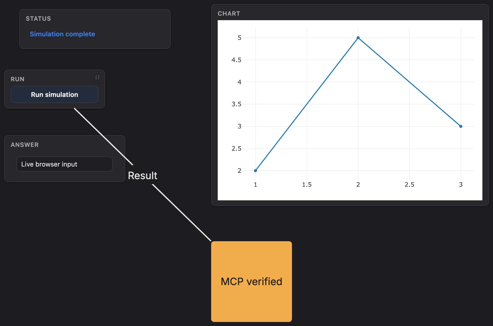

# MCP verification — 2026-09-23

Local validation was performed on branch `codex/danvas-mcp`, based on Danvas
`84ff1e5` (v0.8.0), before publication. No MCP-host configuration was changed.

## Delivered behavior and evidence

| Requirement | Evidence |
|---|---|
| Research MCP frameworks and tools | Decision and primary-source links in [mcp.md](mcp.md#framework-research-and-decision-2026-09-22) |
| Standards-based MCP server | Official Python SDK 2.2.0; real tool discovery, structured results, validation and errors |
| Both local transports | SDK client tests of stdio subprocess and Streamable HTTP; DNS-rebinding rejection and HTTP session reuse |
| Create and edit live canvases | Real compiled Rust broker; creation, updates, layout, visibility and removal verified in Chromium |
| Supported panels | 11 kinds tested through creation/update/layout/hide/reveal/removal; all saved and restored |
| Diagrams | Seven shape kinds, shape updates, arrows and dependent-arrow removal |
| Bidirectional interaction | Chromium button, slider, toggle, text, React and HTML input received through MCP events; update rendered back in browser |
| Visual inspection | PNG returned as MCP image content, decoded and inspected; full board, shapes-only, and single-panel capture tested |
| Persistence | Live input values, layout, hidden state, managed shapes/arrows, merged React updates and view retained; malformed loads roll back |
| File boundaries | Traversal, absolute escape, symlink escape, accidental overwrite and oversized boards rejected |
| Lifecycle | Explicit close and normal stdio/HTTP shutdown release owned broker ports |
| Packaging | Wheel built, installed in a clean virtual environment outside the checkout, then discovered and exercised over MCP stdio |
| Repeatable checks | Dedicated Linux CI workflow for Python 3.10 and 3.13, building frontend and Rust broker before MCP tests |

The tested local environment is macOS arm64, Python 3.12.12, MCP SDK 2.2.0,
Playwright 1.63.0 / Chromium 153, Node's Vite frontend build, and Rust 1.98.1.
The CI workflow had not been run on GitHub at the time of this local validation.

## Results

- MCP acceptance and service suite: **64 passed**, no skips.
- Full repository regression run: **945 passed, 20 skipped, 2 pre-existing screenshot-baseline failures** (details below).
- Coverage measurement: **93% combined**, including **98% of the adapter service**.
  Several server entrypoint/tool-wrapper lines execute in subprocesses and are
  outside the in-process coverage measurement; transport tests exercise them.
- Ruff: passed for all new Python source and tests.
- Mypy: passed for both new Python modules. The adapter deliberately treats the
  native Canvas as a dynamic boundary because its existing `.pyi` omits several
  current shape, screenshot and lifecycle APIs; live tests exercise that boundary.
- Frontend TypeScript check and production build: passed.
- Rust release broker build: passed.
- Wheel build and clean-install MCP smoke: passed.
- Source whitespace/diff check: passed.

The upstream screenshot baselines `hello_world` and `page_layout` fail in this
local browser environment at **1.20%** and **4.48%** pixel difference respectively
(1% threshold). Both were reproduced at the identical fractions in a detached,
unmodified checkout of `84ff1e5` using the upstream release broker. They are not
caused by the MCP integration; their baselines were not rewritten to hide them.

The independent existing suite skips optional video, matplotlib, serial and Rust
SDK example tests when those prerequisites are absent, plus the unsupported macOS
parent-death signal case. MCP integration tests require their own prerequisites
and do not silently skip missing broker/Chromium.

## Screenshot fix found by acceptance testing

Danvas's native whole-canvas export originally computed bounds from panels alone.
A note below a chart was cut off, and a shapes-only board could not be captured.
The frontend now frames both panels and drawings, uses the renderer's default
note dimensions, adds edge padding, and filters non-target drawings on single-panel
exports. The committed bundle and locally compiled broker include the fix.

The final adapter/frontend source hashes are recorded in
[mcp-evidence/source-hashes.json](mcp-evidence/source-hashes.json).
See [mcp.md](mcp.md) for commands, configuration, supported tool surface and limits.
